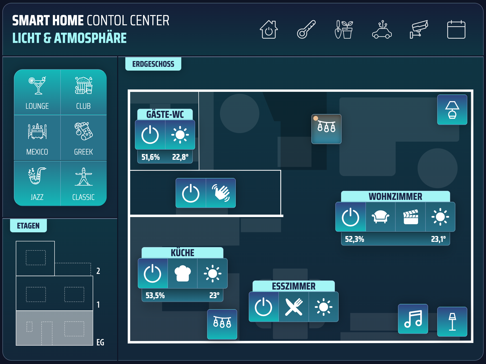

# Smart Home UI

## Introduction

The __Smart Home UI__ is a PHP/JavaScript based user interface for controlling devices via tablet (i.e. wall mounted) or web browser. Due to its modular design it can be used in a variety of use-cases in which users should be able to invoke actions (i.e. smart lighting) via graphical user interface.

## Whats the difference to other UIs like VIS or OpenHAB

The idea behind this application is to avoid complicated and unreliable designers with an overload of options while still providing a very professional and modern look & feel. Beside that, very lean config files (JSON) which are easy to understand, to maintain and to extend allow to build UIs quickly. 

Making the configuration files leaner yet more flexible is the central mission of this project and the main difference to other projects that focus particularly on visual design features.  

## Getting Started / Preconditions

To run this application it is mandatory that you fullfil following preconditions:

- Webserver with working PHP installation (>7.4)

Additionally if you want to access devices via ioBroker:

- ioBroker
- ioBroker REST API

## Limitations

As this project is still in a very early stage and furthermore is bespoken for my personal needs it may not be the best choice for you. This is especially true if you are searching for a solution including a visual designer.

For getting the most out of this project for you, it will also be neccessary to create additional media (i.e. floorplans) with third-party software and include it to your installation. 

## ioBroker Adapter

This application __does not__ include any direct interfaces to smart home devices. However it has an adapter for the ioBroker-API and therefore can access all devices that are compatible with that. The adapter can be used after activating the REST-API on your ioBroker installation and change the information in __adapters/ioBroker.adapter.js__:

```
this.addEventListener("load", function () {

    Adapters.iobroker = new iobroker('https://my.iobroker.api', '8087');

});
```

### Invoke API Action

If you want to control a ioBroker provided smart home device with this UI you can i.e. set up a canvas module with a group of buttons controlling the devices via __action__-tag:

```
{
    "title": "My Room",
    "type": "buttongroup",
    "left": "35%",
    "top": "75%",
    "controls": [
        {
            "type": "switch",
            "id": "switch-my-room",
            "binding": "hue.0.light1",
            "bindingProvider": "iobroker",
            "img": "img/icons/switch.svg",
            "action": "sendDefaultRequest('trigger', { deviceId: 'hue.0.light1' }, this, 'KEY1');"
        },
        {
            "type": "select",
            "img": "img/icons/scene_eat.svg",
            "action": "sendDefaultRequest('scene', { sceneId: 'hue.0.scene_1' }, this, 'SCENE');"
        },
        {
            "type": "select",
            "img": "img/icons/scene_bright.svg",
            "action": "sendDefaultRequest('scene', { sceneId: 'hue.0.scene_2' }, this, 'SCENE');"
        }
    ]
}
```

## Configuration

The configuration of the UI takes place in JSON files. The starting point for every installation is the __config.json__ file in the root folder. You will find a __config.example.json__ file to begin with (rename required). 

The config file defines the views that are stored in the __/views__ folder. The view configuration can be also divided into several files for better maintenance. The sub-configs, which can be referenced by the '__external' tag are stored in the __/config__ folder.

### Main Configuration (config.json)

```
{   
    "header": "<strong>SMART HOME</strong> CONTOL CENTER",
    "theme": "purple",
    "viewWidth": "1024px",
    "viewHeight": "768px",
    "viewGridColumns": "25",
    "viewGridRows": "20",
    "headerStart": "1;1",
    "headerEnd": "3;25",
    "views": 
    [
        {
            "id": "home",
            "img": "img/main_lights.svg",
            "__external": "example"
        }
    ]
}
```
### View Configuration (/views/example.json)

```
{
    "header": "Example View with News Module",
    "isHome": true,
    "modules":
    [
        {
            "id": "news",
            "header": "NEWS",
            "class": "border-left border-bottom rounded-bottom-left",
            "start": "4;1",
            "end": "20;10",
            "module": "news.module"
        }
    ]
}
```

## Canvas Module

The UI can be assembled using different modules (news, weather, canvas,...). The modules can be found in the __/modules__ folder and included in the modules-area in a views config file.  

<br/>
<p align="center">
    
    <p align="center">Screenshot of main view with news and weather</p>
</p>
<br/>

A module is called by the __module__-tag (i.e. "canvas.module"). Its properties are specified in the __moduleProperties__-area. For better maintenance and transparency it is useful to put these in external files via ____external__-tag. These files must be stored in the "/config" folder. The __/config__ folder must be created and is not part of the distribution.

```
"module": "canvas.module",
"conditions": [
    {
        "binding": "alexa2.0.Echo-Devices.XXX.Player.currentState",
        "value": false,
        "style": {
            "visibility": "visible"
        }
    },
    {
        "binding": "alexa2.0.Echo-Devices.XXX.Player.currentState",
        "value": true,
        "style": {
            "visibility": "hidden"
        }
    }
],
"moduleProperties": {
    "__external": "lockscreen/lock-calendar"
}
```

With the __canvas module__ you can arrange different types of user controls on a canvas. This gives you the ability to create floorplans with buttons to control particular smart home devices that are connected via ioBroker or any other adapter. 

<br/>
<p align="center">
    
    <p align="center">Screenshot of floorplan using canvas module</p>
</p>
<br/>

## Weather Module

The Weather Module is based on the "DasWetter" adapter in ioBroker and needs a valid (free) subscription of this weather API. Please see following configuration example to see how the module works. 

```
{
    "id": "lock-weather",
    "start": "8;16",
    "end": "16;24",
    "module": "weather.module",
    "moduleProperties": {
        "max_temp": "daswetter.0.NextDays.Location_1.Day_1.Maximale_Temperatur_value",
        "min_temp": "daswetter.0.NextDays.Location_1.Day_1.Minimale_Temperatur_value",
        "day_name": "daswetter.0.NextDays.Location_1.Day_1.Tag_value",
        "icon_url": "daswetter.0.NextDays.Location_1.Day_1.iconURL",
        "weather_text": "daswetter.0.NextDays.Location_1.Day_1.Wetter_Symbol_value",
        "wind_text": "daswetter.0.NextDays.Location_1.Day_1.Wind_value",
        "icon_url_prefix": "http://192.167.178.70:8081"
    }
}
```

## Lock Screen

As one major purpose of this application is to be used as wall mounted device it also includes a feature for showing a lock-screen during idle times that can be dimmed during the night. 

The lock screen also provides the ability to include modules like widgets. 

<br/>
<p align="center">
    
    <p align="center">Screenshot of lock screen with some modules as widgets</p>
</p>
<br/>

## Add new Features to the Application

The program is designed to load any PHP or script files as long as they are located in the __modules/__ or __script/__ folder. In this way you can easily extend the application without actually modifying the original source code. For example you can add a JavaScript file with functions that are called through the __action__-tag of a switch button. 

### Adapters

You can write own adapters for other platforms that you use by copying the ioBroker.adapter.js and changing the functions and names in it to meet your requirements. By "self-registering" them through extending the global __Adapters__-object you can then refer to this adapter by using the __bindingProvider__-tag in den config files. 

### Modules

Please feel free to develop own modules that can provide standardized information and features more easily. The modules must match the __IModule__-interface and extend the __Module__-class. 

## Contact

If you want to get in contact with me, ask for features or contribute to this project, please feel free to do so via GitHub.
