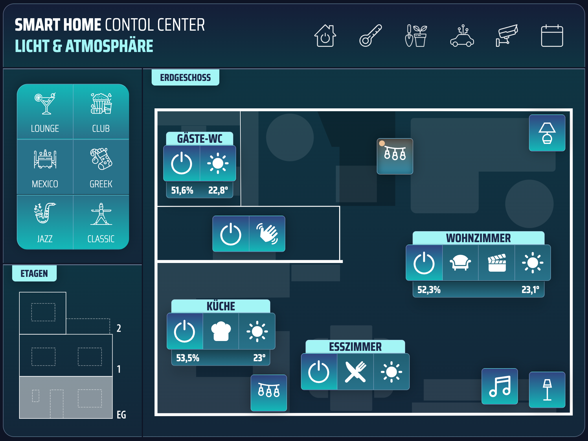
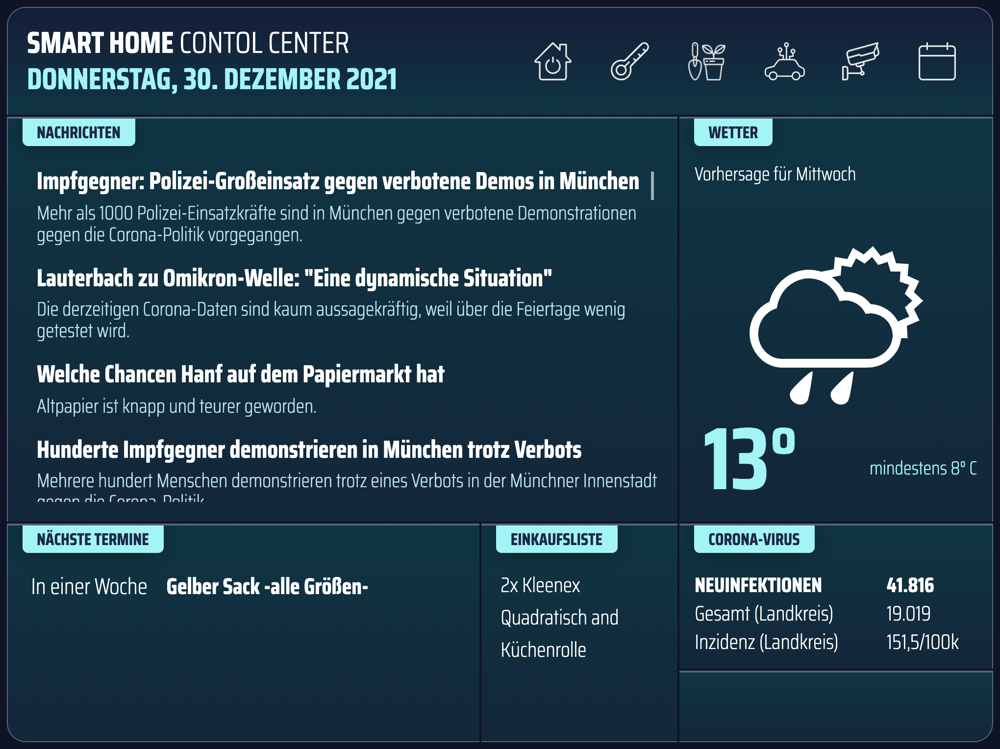

# Smart Home UI

## Introduction

The _Smart Home UI_ is a PHP/JavaScript based user interface for controlling devices via tablet (i.e. wall mounted) or web browser. Due to its modular design it can be used in a variety of use-cases in which users should be able to invoke actions (i.e. smart lighting) via graphical user interface.

## Getting Started / Preconditions

To run this application it is mandatory that you fullfil following preconditions:

- Webserver with working PHP installation (>7.4)

Additionally if you want to access devices via ioBroker:

- ioBroker
- ioBroker REST API

## Limitations

As this project is still in a very early stage and furthermore is besopken for my personal needs it may not be the best choice for you. This is especially true if you are searching for a solution including a visual designer.

For getting the most out of this project for you, it will also be neccessary to create additional media (i.e. floorplans) with third-party software and include it to your installation. 

## ioBroker Adapter

This terminal DOES NOT include any direct interfaces to smart home devices. However it has an adapter for the ioBroker-API and therefore can access all devices that are compatible with that. The adapter can be used after activating the REST-API on your ioBroker installation and change the information in adapters/ioBroker.adapter.js:

```
this.addEventListener("load", function () {

    Adapters.iobroker = new iobroker('https://my.iobroker.api', '8087');

});
```

### Invoke API Action

If you want to control a ioBroker provided smart home device with this UI you can i.e. set up a canvas module with a group of buttons controlling the devices via _action_-tag:

```
{
    "title": "My Room",
    "type": "buttongroup",
    "left": "35%",
    "top": "75%",
    "controls": [
        {
            "type": "switch",
            "id": "switch-my-room",
            "binding": "hue.0.light1",
            "bindingProvider": "iobroker",
            "img": "img/icons/switch.svg",
            "action": "sendDefaultRequest('trigger', { deviceId: 'hue.0.light1' }, this, 'KEY1');"
        },
        {
            "type": "select",
            "img": "img/icons/scene_eat.svg",
            "action": "sendDefaultRequest('scene', { sceneId: 'hue.0.scene_1' }, this, 'SCENE');"
        },
        {
            "type": "select",
            "img": "img/icons/scene_bright.svg",
            "action": "sendDefaultRequest('scene', { sceneId: 'hue.0.scene_2' }, this, 'SCENE');"
        }
    ]
}
```

## Configuration

The configuration of the UI takes place in JSON files. The starting point for every installation is the _config.json_ file in the root folder. You will find a "config.example.json" file to begin with (rename required). 

The config file defines the views that are stored in the _/views_ folder. The view configuration can be also divided into several files for better maintenance. The sub-configs, which can be referenced by the '__external' tag are stored in the _/config_ folder.

### Main Configuration (config.json)

```
{   
    "header": "<strong>SMART HOME</strong> CONTOL CENTER",
    "theme": "purple",
    "viewWidth": "1024px",
    "viewHeight": "768px",
    "viewGridColumns": "25",
    "viewGridRows": "20",
    "headerStart": "1;1",
    "headerEnd": "3;25",
    "views": 
    [
        {
            "id": "home",
            "img": "img/main_lights.svg",
            "__external": "example"
        }
    ]
}
```
### View Configuration (/views/example.json)

```
{
    "header": "Example View with News Module",
    "isHome": true,
    "modules":
    [
        {
            "id": "news",
            "header": "NEWS",
            "class": "border-left border-bottom rounded-bottom-left",
            "start": "4;1",
            "end": "20;10",
            "module": "news.module"
        }
    ]
}
```

## Canvas Module

The UI can be assembled using different modules (news, weather, canvas,...). The modules can be found in the _/modules_ folder and included in the modules-area in a views config file.  

<p align="center">
    
    <p align="center">#####Screenshot of main view with news and weather</p>
</p>

A module is called by the "module"-tag (i.e. "canvas.module"). Its properties are specified in the "moduleProperties"-area. For better maintenance and transparency it is useful to put these in external files via "__external"-tag. These files must be stored in the "/config" folder. The "/config" folder must be created and is not part of the distribution.

```
"module": "canvas.module",
"conditions": [
    {
        "binding": "alexa2.0.Echo-Devices.G090LA09751703CL.Player.currentState",
        "value": false,
        "style": {
            "visibility": "visible"
        }
    },
    {
        "binding": "alexa2.0.Echo-Devices.G090LA09751703CL.Player.currentState",
        "value": true,
        "style": {
            "visibility": "hidden"
        }
    }
],
"moduleProperties": {
    "__external": "lockscreen/lock-calendar"
}
```

With the _canvas module_ you can arrange different types of user controls on a canvas. This gives you the ability to create floorplans with buttons to control particular smart home devices that are connected via ioBroker or any other adapter. 

<p align="center">
    
    <p align="center">#####Screenshot of floorplan using canvas module</p>
</p>

## Weather Module

The Weather Module is based on the "DasWetter" adapter in ioBroker and needs a valid (free) subscription of this weather API. Please see following configuration example to see how the module works. 

```
{
    "id": "lock-weather",
    "start": "8;16",
    "end": "16;24",
    "module": "weather.module",
    "moduleProperties": {
        "max_temp": "daswetter.0.NextDays.Location_1.Day_1.Maximale_Temperatur_value",
        "min_temp": "daswetter.0.NextDays.Location_1.Day_1.Minimale_Temperatur_value",
        "day_name": "daswetter.0.NextDays.Location_1.Day_1.Tag_value",
        "icon_url": "daswetter.0.NextDays.Location_1.Day_1.iconURL",
        "weather_text": "daswetter.0.NextDays.Location_1.Day_1.Wetter_Symbol_value",
        "wind_text": "daswetter.0.NextDays.Location_1.Day_1.Wind_value",
        "icon_url_prefix": "http://192.167.178.70:8081"
    }
}
```

## Contact

If you want to get in contact with me, ask for features or contribute to this project, please feel free to do so via GitHub.
